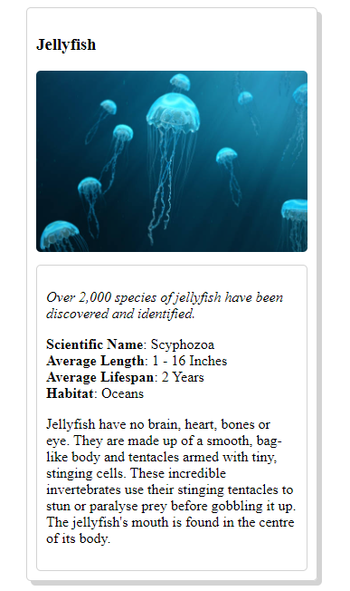

# animal-trading-cards
Animal Trading Cards Project for Udacity's Web Nanodegree Programs.

## Prototype

## Card.html
My trading card animal was Jellyfish.

## About the Project 
This is an introductory project on frontend web-development from udacity.
An HTML document was provided and I style it using CSS to match the prototype that was given.

